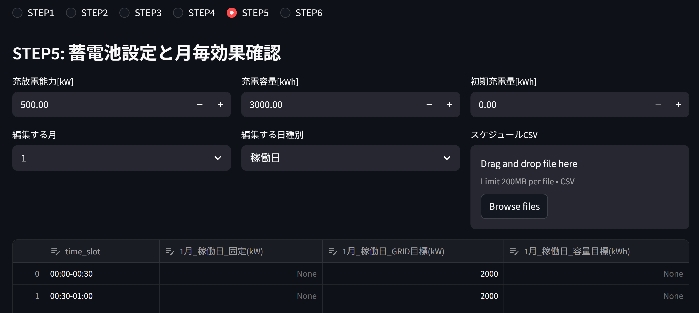
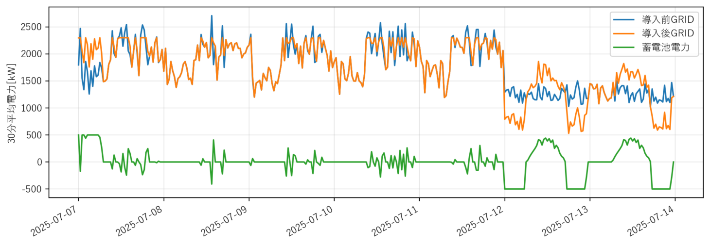
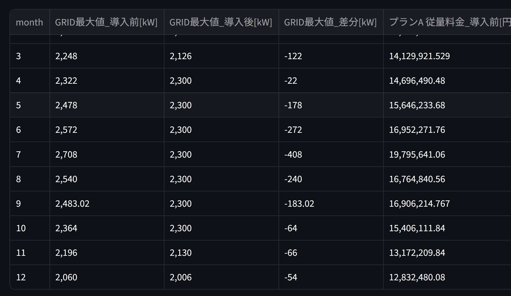

# ⚡ 蓄電池コスト最適化シミュレータ

[English version](README.md)

30分単位（年間17,520点）の電力データを用いて、
電気料金をシミュレーションし、蓄電池の運用戦略によるデマンド削減効果を評価します。

👉 実務での意思決定を目的としたエネルギー最適化ツール

---

## 🖼 画面例

### UI (Battery Scheduling)


### Demand Reduction (Before / After)


### Monthly Cost Impact


---

## 📊 計算規模

* 時系列データ：17,520点（30分 × 1年）
* 料金単価：1,152パターン（30分 × 平日/休日 × 12ヶ月）
* 複数モードによる蓄電池スケジューリングシミュレーション

---

## 🔋 機能

* 蓄電池運用モード：

  * 固定モード
  * GRID目標モード（デマンドカット）
  * 容量目標モード（SoC制御）

* 月別・年間のコスト評価

* 代表週の自動抽出

* CSV / ZIP によるプロジェクト入出力

---

## 🧠 技術的特徴

* NumPyによるベクトル化計算
* 計算エンジンとUIの分離構造
* 制約条件付きシミュレーション
* キャッシュによる高速実行（年間約0.3秒）

---

## 📈 解決する課題

従来の手計算では：

* 数万点の時系列データ処理
* 複雑な料金単価の適用
* 複数運用パターンの試行

が必要になります。

👉 本ツールはこれらを自動化します

---

## 🔒 データの取り扱い

* 機密情報・非公開データは使用していません
* 公開情報および一般的な工学的知見に基づいて構築
* 乱数生成データにより再現可能

---

## ⚠️ 前提条件

* 再生可能エネルギーは考慮していません
* 蓄電池の効率・劣化・損失は未考慮
* 再エネ賦課金などの追加料金は未考慮
* 結果は概算値です

---

## ▶️ 実行方法

```
pip install -r requirements.txt
streamlit run app.py
```

---

## 💡 コンセプト

理論モデルではなく、
実務での意思決定に使える実用的なシミュレーションツールです。

---

## 👤 作者

電気工学 × ソフトウェア × エネルギー最適化
