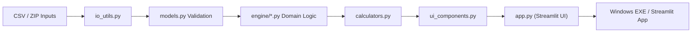

# Architecture

## Intent

This project separates UI, input handling, and domain logic so that:

- the Streamlit layer remains thin
- business rules stay testable
- CSV format handling can evolve independently

## Layers

### UI layer

- `app.py`
- `ui_components.py`

Responsible for screen flow, user interaction, and presentation.

### Application / adapter layer

- `io_utils.py`
- `calculators.py`

Responsible for:

- converting external CSV formats into validated internal structures
- exposing calculation entry points to the UI
- ZIP import/export for repeatable analysis

### Domain layer

- `models.py`
- `engine/*.py`

Responsible for:

- input validation
- tariff logic
- calendar handling
- battery simulation
- annual and monthly aggregation

## Why this matters

For a business-facing analysis tool, maintainability is not only about code style.
It is about being able to change:

- input file formats
- pricing rules
- simulation assumptions
- UI flows

without rewriting everything.

## Design message for portfolio review

This structure is intentionally designed to show:

- separation of UI and business logic
- practical handling of messy real-world input formats
- explicit validation before simulation
- packaging and distribution awareness for non-developer users
